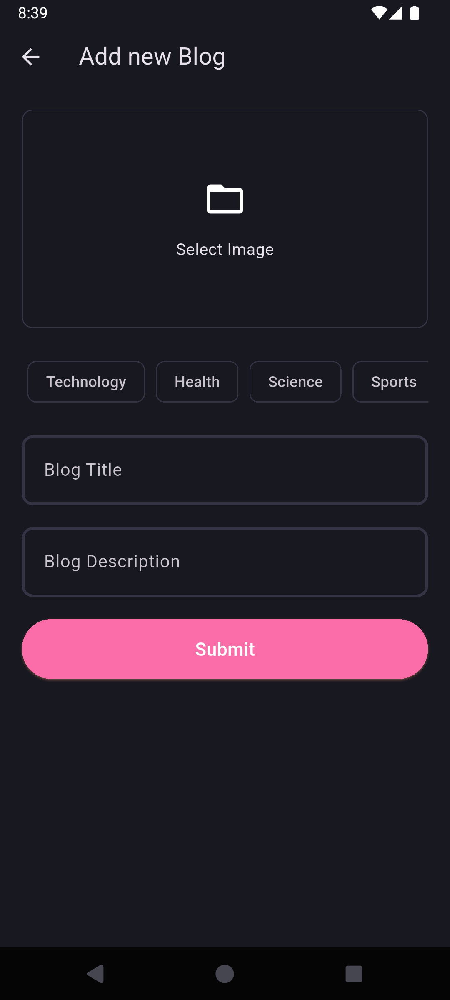
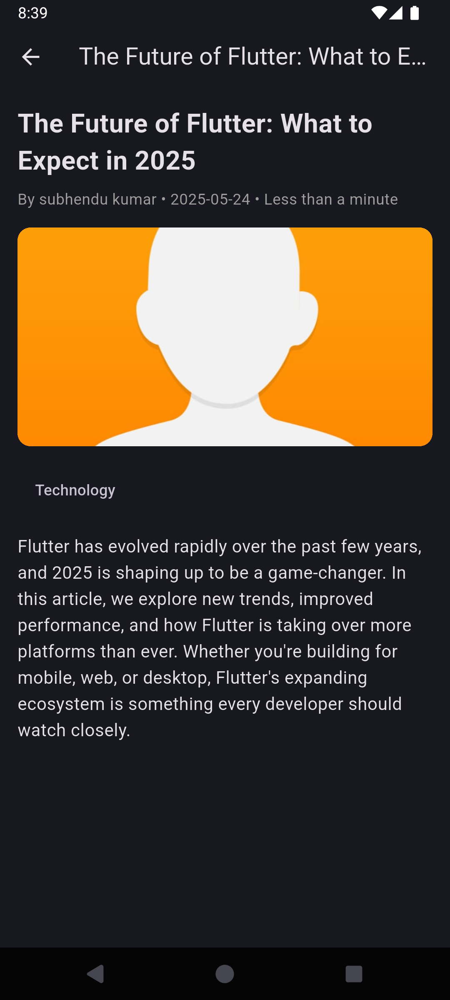

# Flutter Blog App with Firebase - Clean Architecture

A modern blog application built with Flutter and Firebase following Clean Architecture principles. This app allows users to create, read, update, and delete blog posts with proper separation of concerns and maintainable code structure.

## 📱 Demo Screenshots

<div align="center">
  
  
  
  
  
</div>

## Features

- **Authentication**

  - User registration and login
  - Email/password authentication
  - Password reset functionality
  - User profile management

- **Blog Management**

  - Create, read, update, and delete blog posts
  - Rich text content with descriptions
  - Image upload for blog thumbnails
  - Topic-based categorization
  - Real-time data synchronization

- **Architecture**
  - Clean Architecture implementation
  - Separation of Data, Domain, and Presentation layers
  - Repository pattern for data management
  - Use cases for business logic
  - BLoC/Cubit for state management

## Architecture Overview

This project follows Clean Architecture principles with three main layers:

```
┌─────────────────────────────────────┐
│           Presentation              │  ← UI, BLoC/Cubit, Pages, Widgets
├─────────────────────────────────────┤
│             Domain                  │  ← Entities, Use Cases, Repository Interfaces
├─────────────────────────────────────┤
│              Data                   │  ← Repository Implementation, Data Sources, Models
└─────────────────────────────────────┘
```

## Prerequisites

- [Flutter](https://flutter.dev/docs/get-started/install) (latest stable version)
- [Dart](https://dart.dev/get-dart) (latest stable version)
- [Firebase account](https://firebase.google.com/)
- [Git](https://git-scm.com/downloads)
- Android Studio / VS Code with Flutter extensions
- Physical device or emulator for testing

## Project Structure

```
lib/
├── main.dart                           # Entry point
├── my_blog_app.dart                    # Main App
├── init_dependencies.dart              # Dependency injection setup
│
├── core/                               # Core utilities and shared code
│   ├── common/                         # Common utilities
│   │   ├── cubits/                     # Shared cubits (app_user_cubit)
│   │   ├── entities/                   # Core entities
│   │   └── widgets/                    # Reusable widgets
│   ├── error/                          # Error handling
│   ├── network/                        # Network utilities
│   ├── secrets/                        # API keys and secrets
│   ├── theme/                          # App theming
│   ├── usecase/                        # Base use case classes
│   └── utils/                          # Utility functions
│
├── features/                           # Feature modules
│   ├── auth/                           # Authentication feature
│   │   ├── data/                       # Data layer
│   │   │   ├── datasources/            # Data sources
│   │   │   ├── models/                 # Data models
│   │   │   └── repositories/           # Repository implementations
│   │   ├── domain/                     # Domain layer
│   │   │   ├── entities/               # Domain entities
│   │   │   ├── repository/             # Repository interfaces
│   │   │   └── usecases/               # Use cases
│   │   └── presentation/               # Presentation layer
│   │       ├── bloc/                   # BLoC/Cubit
│   │       ├── pages/                  # UI screens
│   │       └── widgets/                # Feature-specific widgets
│   │
│   └── blog/                           # Blog feature
│       ├── data/                       # Data layer
│       │   ├── datasources/            # Data sources
│       │   ├── models/                 # Data models
│       │   └── repositories/           # Repository implementations
│       ├── domain/                     # Domain layer
│       │   ├── entities/               # Domain entities
│       │   ├── repository/             # Repository interfaces
│       │   └── usecases/               # Use cases
│       └── presentation/               # Presentation layer
│           ├── bloc/                   # BLoC/Cubit
│           ├── pages/                  # UI screens
│           └── widgets/                # Feature-specific widgets
```

## Data Models

### User Entity

```dart
class User {
  final String id;
  final String name;
  final String email;

  User({
    required this.id,
    required this.name,
    required this.email,
  });
}
```

### Blog Entity

```dart
class Blog {
  final String id;
  final String author;
  final String title;
  final String description;
  final String imageUrl;
  final List<String> topics;
  final DateTime updatedAt;
  final String? authorName;

  Blog({
    required this.id,
    required this.author,
    required this.title,
    required this.description,
    required this.imageUrl,
    required this.topics,
    required this.updatedAt,
    this.authorName,
  });
}
```

## Dependencies

Add these dependencies to your `pubspec.yaml`:

```yaml
dependencies:
  flutter:
    sdk: flutter

  cupertino_icons: ^1.0.8
  fpdart: ^1.1.1
  flutter_bloc: ^9.1.1
  firebase_core: ^3.13.1
  firebase_auth: ^5.5.4
  get_it: ^8.0.3
  supabase_flutter: ^2.9.0
  image_picker: ^1.1.2
  uuid: ^4.5.1
  internet_connection_checker_plus: ^2.7.2
  path_provider: ^2.1.0
  hive: ^2.2.3

dev_dependencies:
  flutter_test:
    sdk: flutter
  flutter_lints: ^2.0.3
```

## Setup Instructions

### 1. Clone the Repository

```bash
git clone https://github.com/Subhendu-Kumar/flutter_blog_app.git
cd flutter_blog_app
```

### 2. Install Dependencies

```bash
flutter pub get
```

### 3. Configure Secrets

Create `lib/core/secrets/app_secrets.dart`:

```dart
class AppSecrets {
  static const supabaseUrl = 'YOUR_SUPABASE_URL';
  static const supabaseAnonKey = 'YOUR_SUPABASE_ANON_KEY';
}
```

### 4. Initialize Dependencies

The app uses GetIt for dependency injection. All dependencies are configured in `lib/init_dependencies.dart`.

## Supabase Database Structure

1. **users**

   ```json
   {
     "id": "user_id",
     "name": "John Doe",
     "email": "john@example.com",
     "createdAt": "timestamp"
   }
   ```

2. **blogs**
   ```json
   {
     "id": "blog_id",
     "author": "user_id",
     "title": "Blog Title",
     "description": "Blog content...",
     "image_url": "https://storage_url/image.jpg",
     "topics": ["flutter", "firebase", "mobile"],
     "updated_at": "timestamp"
   }
   ```

## Key Features Implementation

### Clean Architecture Benefits

1. **Separation of Concerns**: Each layer has a specific responsibility
2. **Testability**: Easy to unit test business logic
3. **Maintainability**: Changes in one layer don't affect others
4. **Scalability**: Easy to add new features following the same pattern

### State Management with BLoC

The app uses BLoC pattern for state management:

- **AuthBloc**: Handles authentication states
- **BlogBloc**: Manages blog-related operations
- **AppUserCubit**: Manages global user state

### Repository Pattern

Data access is abstracted through repository interfaces:

- Domain layer defines repository contracts
- Data layer implements these contracts
- Presentation layer depends on abstractions, not implementations

## Contributing

1. Fork the repository
2. Create a feature branch following the clean architecture pattern
3. Implement your feature with proper separation of concerns
4. Add tests for your implementation
5. Submit a pull request

## Architecture Guidelines

When adding new features:

1. **Start with Domain Layer**: Define entities and use cases
2. **Implement Data Layer**: Create repositories and data sources
3. **Build Presentation Layer**: Create BLoC/Cubit and UI components
4. **Add Dependency Injection**: Register new services in `init_dependencies.dart`

## License

This project is licensed under the MIT License - see the LICENSE file for details.

## Contact

Subhendu Kumar - subhendukumardutta330@gmail.com
Project Link: https://github.com/Subhendu-Kumar/flutter_blog_app
